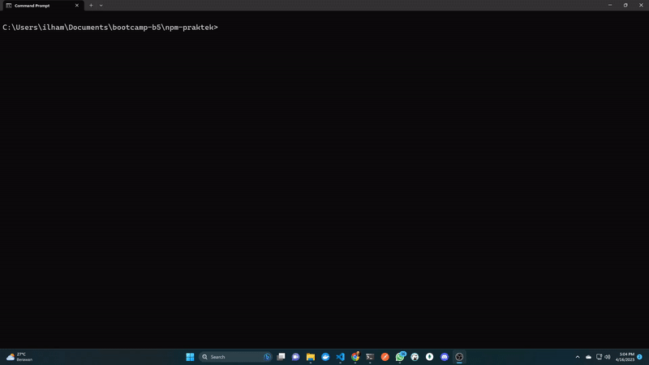

# Take Home Task
## buat struktur folder temen temen seperti ini.
```
day20takehometask/ (bebas)
├── src/
│   ├── shape.js
│   └── student.js    
├── index.js
└── package.json
```

## Keterangan:
- file src/shape.js adalah file yang berisi method untuk menghitung luas dan keliling persegi, segitiga dan lingkaran
- file src/student.js adalah file yang berisi method untuk menyimpan bentuk data mahasiswa (sebuah class dengan property nama, nim, dan kelas beserta setter dan getter)
- file index.js adalah file yang:
    1. dapat menerima inputan user dari terminal/cmd
    2. memanggil file src/shape dan src/student.
    3. buat program seperti pada gambar dibawah (contoh.gif)


